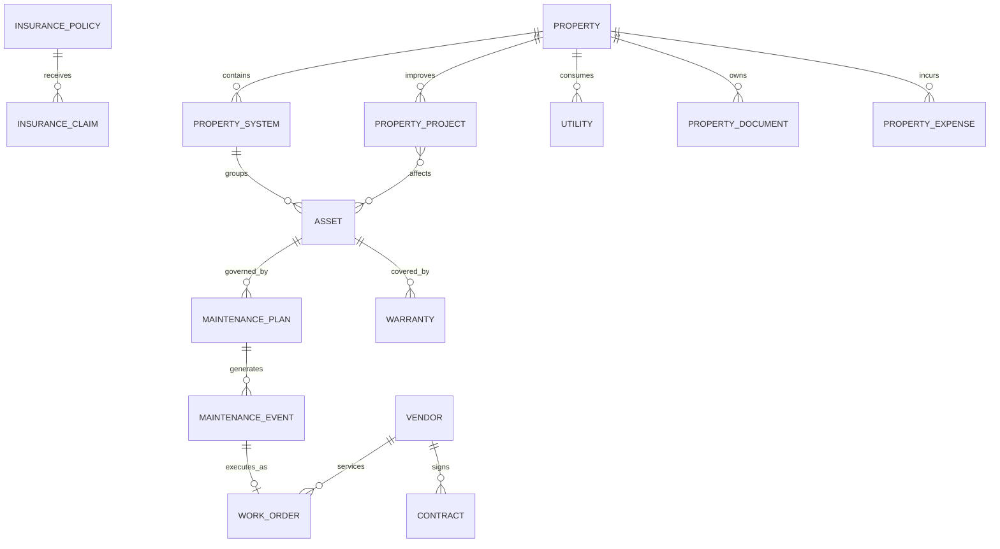

# Malbec Estate absorption: Phase 1 forensic audit

Governing specification: [Brevity issue #27](https://github.com/lsljco/brevity/issues/27)

- Audit date: 2026-08-23
- Brevity baseline: `c1fd5e4` (`main`)
- Malbec Estate baseline: `main`, `index.html` blob `4f3cfcb7c1f5fe2a529454f59c226aefde9b31fe`

## Executive finding

Malbec Estate is not a property database. It is a compiled, browser-local household operating system whose property-management value is concentrated in maintenance, project milestones, supply inventory, calendar behavior, archive/reporting patterns, and document/vendor/warranty taxonomies. Brevity already has the stronger modular architecture for projects, calendar, finance, authentication, household membership, and AI.

The highest data-loss risk is not in GitHub. Malbec's mutable records live under `malbecHOS_*` keys in each browser's `localStorage`. The repository contains initial seed/default records, not a reliable copy of household history. Every device/browser that was used with Malbec must therefore be exported and reconciled before cutover.

## Repository architecture

### Malbec Estate

- Static Netlify site with a single 14,705,784-character, 19,582-line `index.html`.
- React and ReactDOM production runtimes, application code, CSS, seed data, and large base64 JPEG assets are bundled into the HTML.
- No package manifest or source-module tree is present on the audited branch.
- One Netlify function, `netlify/functions/icloud-calendar.mjs`, provides CalDAV CRUD.
- `netlify.toml` publishes the repository root, uses esbuild for functions, and sets baseline security headers.
- Application state uses a custom `usePersistentState` hook backed by browser `localStorage` with prefix `malbecHOS_`.
- No central application database, household authentication, user permissions, audit log, record versioning, concurrency control, server backup, or multi-device synchronization exists.

### Brevity

- React 18 + Vite application with modular `assistant`, `family`, `finance`, `homehq`, and `household` domains.
- Netlify Functions provide household authentication, shared data, iCloud/CalDAV, Plaid, OpenAI, documents, and scheduled household planning.
- Netlify Blob storage is already used for signed household accounts, shared records, daily plans, Plaid tokens, and sermon documents.
- Household sessions are signed, HttpOnly, Secure, SameSite=Strict cookies. Current roles are `admin` and `member`.
- HomeHQ has projects, RACI, status, priority, dates, estimated/actual cost, contractor details/compliance, photos/files, budget, timeline, and calendar publishing.
- HomeHQ's primary record remains `homehq_items_v1` in `localStorage`; a whole-record sync copies it to Netlify Blobs. This is a useful compatibility bridge but is not an acceptable normalized Estate store.

## Malbec screen and workflow inventory

| Area | Observed capabilities | Persistence/integration |
|---|---|---|
| Command Center | Daily greeting, prayer focus, Seven Pillars health, readiness, decisions, risks/blockers, wins, spending/operations cues, family updates | Mostly static/seeded presentation |
| Calendar | Month/week/day/agenda, categories, priorities, local event editing, iCloud list/create/update/delete | `malbecHOS_calendar_evs`; CalDAV function |
| Meetings | Morning Alignment, EOD Wrap Up, Finance Meeting | Component state and local records |
| Household Management | Weekly tasks, time blocks, zones, owners, coverage, status, COO confirmation, week archive | `household_*` local keys |
| Supplies & Inventory | Purchase list, category detection, quantities, status, low-stock auto-add to purchasing | `supplies_purch`, `supplies_inv` |
| Maintenance | Command metrics, filters, maintenance table, stages, owners, scheduled dates, recent completions, quick actions | `maintenance_maintenance`, `maintenance_quickActions` |
| Projects | Project list, category, owner, status, current milestone, milestone completion | `maintenance_projects` |
| Spiritual Maturity | Scriptures, prayers, principles, commitments, testimonies, ministry, mission/focus | `spiritual_*` |
| Physical Fitness | Hydration, workouts, cardio, focus, recovery, milestones, training plan, group activity, wellness | `fitness_*` |
| Health & Nutrition | Recipes, meal rotation, macros, ingredients, appointments, medications, allergies, conditions, documents, reminders | `nutrition_*`, `health_*` |
| Education | Roadmaps, courses, reading, skills, opportunities, milestones | `edu_*` |
| Finance | Snapshot, goals, stewardship focus, budget, cashflow, savings, milestones | `fin_*`; no bank integration |
| Ministry & Fellowship | Household ministry, prayer, reach, content, outreach, testimonies, milestones | `min_*` |
| Document Vault | Insurance, vehicle, warranty, vendor, legal, and financial category cards | Placeholder: displays zero documents; upload is not implemented |
| Reports & Analytics | 90-day completion, outstanding items, commitment rate, trends, insights, next steps | Seeded/static metrics; export is a toast only |
| Archive | Category navigation and household weekly archive | `household_weekArchive` plus entity-level `archived` flags |
| Settings | Theme, household member list, browser backup/restore, profile UI, calendar URL UI, vacation/automation settings | Member/theme keys persist; several controls are presentation-only |
| Global shell | Sidebar, search index, notifications, themes | Search/notifications primarily seeded/static |

## Malbec browser data inventory

The compiled application declares 65 domain state usages (some reuse the same key) plus theme/member state. All are stored as JSON under `malbecHOS_`.

### Estate and household operations

- `maintenance_maintenance`
- `maintenance_projects`
- `maintenance_quickActions`
- `supplies_purch`
- `supplies_inv`
- `household_weekOffset`
- `household_weekArchive`
- `household_blocks_v2`
- `household_weeklyFocus_v2`
- `household_allTasks`
- `household_statusByDate_v2`
- `calendar_evs`
- `household_members_v2`
- `theme_preference`

### Other Seven Pillars records

- `spiritual_scriptures`, `spiritual_prayers`, `spiritual_principles`, `spiritual_commitments`, `spiritual_testimonies`, `spiritual_ministry`, `spiritual_missionData`, `spiritual_focusCards`
- `fitness_hydration`, `fitness_workouts`, `fitness_cardio`, `fitness_weeklyFocus`, `fitness_recovery`, `fitness_milestones`, `fitness_trainingPlan`, `fitness_moveTogether`, `fitness_wellness`
- `nutrition_recipes_v2`, `nutrition_proteins`, `nutrition_vegetables`
- `health_appointments`, `health_medications`, `health_allergies`, `health_conditions`, `health_documents`, `health_reminders`
- `fin_snapshot`, `fin_goals`, `fin_steward_focus`, `fin_budget`, `fin_cashflow`, `fin_savings`, `fin_milestones`
- `min_household`, `min_prayer`, `min_reach`, `min_content`, `min_outreach`, `min_testimonies`, `min_milestones`
- `edu_roadmaps`, `edu_courses`, `edu_reading`, `edu_skills`, `edu_opportunities`, `edu_milestones`

Malbec Settings exports every local key beginning with `malbecHOS_`. Restore accepts an object containing matching keys, overwrites local values, and reloads. There is no schema version, checksum, device identifier, record-level merge, duplicate detection, or reconciliation report.

## Estate seed record shapes

### Maintenance

`{ id, title, desc, cat, owner, stage, scheduledDate, updated, updatedBy }`

Stages: `Scheduled`, `In Progress`, `Needs Review`, `Completed`.

### Property projects

`{ id, title, desc, cat, owner, status, currentMilestone, milestones[], doneCount, updated, updatedBy }`

Statuses: `Planning`, `In Progress`, `Discussion`, `Completed`.

### Supplies

Purchasing records contain name/category/status. Inventory records contain name/category/quantity and trigger a purchasing record when quantity becomes low.

These shapes are useful extraction inputs, but they are not canonical Estate entities.

## Calendar comparison

| Concern | Malbec | Brevity | Decision |
|---|---|---|---|
| Authorization | Separate shared PIN cookie | Signed Brevity household session | Use Brevity |
| Calendar selection | Configured name or silently first writable calendar | Exact configured `Family` calendar required | Use Brevity |
| Recurrence | Reads VEVENTs without occurrence expansion | Expands recurring events | Use Brevity |
| Time zone | Floating local date/time | Explicit `BREVITY_TIME_ZONE` | Use Brevity |
| Ownership | Category and priority only | Source ID, owner, participants, pillar, priority | Use Brevity |
| Reconciliation | Direct CRUD | Source-scoped create/update/delete reconciliation | Use Brevity |
| Malbec legacy marker | UID suffix `@malbec-estate`, `X-MALBEC-PRIORITY` | `X-BREVITY-*` metadata | Preserve legacy UIDs; do not duplicate |

The Malbec calendar function is classified REPLACE. During migration, existing Apple events must be matched by UID/href/date/title before any Brevity event is created.

## Data, security, persistence, and regression risks

| Priority | Risk | Impact | Required control |
|---|---|---|---|
| Critical | Real Malbec history exists only on individual browsers | Silent loss of records | Export every device/profile; hash, inventory, merge, and reconcile exports |
| Critical | Seed data and real records are indistinguishable without provenance | False history or duplicates | Mark repository defaults as `seed`; mark browser exports with device/extraction metadata; human reconciliation |
| Critical | HomeHQ attachments are base64 inside a single local record | Storage quota, sync-size failures, backup corruption | Extract files to durable object storage; retain checksums and links |
| High | Whole-record last-write-wins synchronization | Cross-device overwrites | Record-level versioning and optimistic concurrency for Estate entities |
| High | Malbec has no authenticated user identity | No trustworthy author history | Attribute migration to import actor; preserve legacy `updatedBy` as unverified source metadata |
| High | Malbec deletions leave no tombstones | A missing row may mean deletion or an older/incomplete browser | Treat absence as unresolved during cross-device reconciliation; require human confirmation before omitting a previously observed row |
| High | Calendar migration can duplicate live Apple events | Duplicate reminders/appointments | UID/source-aware dry run and reconciliation |
| High | Finance/project fields are duplicated | Conflicting totals and contractors | Link to Brevity Finance/Projects/Vendors by IDs; no second ledger/engine |
| High | Placeholder UI implies documents/automation exist | False completeness | Classify placeholders as RETIRE/ADD; never count them as migrated records |
| High | Health/finance data is browser-readable | Sensitive-data exposure | Migrate only to the owning authenticated Brevity domain; least-privilege access |
| Medium | Local dates and inconsistent status vocabularies | Shifted due dates and broken reports | Date-only normalization; explicit status mapping tests |
| Medium | Embedded 14.7 MB HTML and base64 assets | Fragility and slow maintenance | Do not transplant; retain only approved brand/property assets |
| Medium | Existing Brevity `localStorage` consumers expect project keys | Regression during cutover | Compatibility adapter, non-destructive backup, dual-read validation, then controlled cutover |
| Medium | Netlify Blob is document-oriented, not relational | Cross-entity query/constraint limits | Normalized IDs, indexes, audit records, export API; define later Postgres threshold |

## Canonical Estate relationship model

All records also carry household scope, timestamps, actor identity, version, and source metadata. Cross-domain links use stable IDs rather than copied names or amounts.

## Persistence decision

The first Estate increment will use a dedicated authenticated Estate repository on Netlify Blobs because it is consistent with Brevity's deployed backend and avoids another platform dependency during forensic migration. It will not copy the existing `localStorage` sync design.

The Estate repository must use:

- one durable record per entity;
- household-scoped keys;
- admin-only writes for the initial increment and authenticated household reads;
- optimistic record versions;
- immutable audit entries for mutations and imports;
- source/legacy metadata and content hashes;
- migration manifests and exportable reconciliation summaries;
- attachments stored separately from entity JSON.

Move to Postgres before wider household role matrices, high-volume document metadata, advanced multi-property reporting, or transactional cross-entity workflows make document-store indexes unsafe or cumbersome.

## Module extension decisions

### Extend existing Brevity modules

- HomeHQ/Projects: property context, system/asset links, project compatibility adapter, milestones, RACI, costs, vendor IDs, inspections/permits/documents.
- Family Calendar: Estate event source types and source-scoped reconciliation.
- Finance: property/system/asset/project/vendor dimensions and OpEx/CapEx classification.
- Household/Auth: Estate read/write policies and stable member crosswalk.
- Assistant: server-fetched, sanitized Estate context; read-only first.
- Settings/Backup: Estate export/import manifests and reconciliation reports.

### Add new Estate modules

- Property and property systems
- Asset registry
- Preventive maintenance plans/events and work orders
- Reusable vendors/contracts/warranties
- Estate document metadata and object storage
- Insurance policies/claims
- Utilities
- Inspections
- Property expense link records
- Migration/extraction/reconciliation tooling

## Phased implementation sequence

1. Foundation: model, authenticated record repository, audit/versioning, migration manifest, Malbec transform tests.
2. Property shell: generic `Property`, Malbec Estate workspace, systems, drill-through routes, legacy launch retained.
3. HomeHQ bridge: non-destructive `homehq_items_v1` extraction, normalized project links, compatibility reads, project regression tests.
4. Asset and vendor registry: systems/assets/vendors/contracts/warranties and document relationships.
5. Preventive maintenance: plans generate events/work orders; assignment and Family Calendar publishing.
6. Estate Vault: object storage, checksums, metadata, related-record drill-through, export verification.
7. Finance and reports: dimensions, OpEx/CapEx, transaction links, property/system/asset/project/vendor reporting.
8. Assistant read access: server-side Estate context and Estate question set; controlled writes remain disabled.
9. Malbec ETL: collect every browser export, dry run, transform, import, count/field/hash/relationship reconciliation.
10. Parallel validation: permissions, multiple devices, calendar, finance, files, projects, assets, maintenance, vendors.
11. Read-only acceptance: final backup/export, freeze legacy writes, production verification, user acceptance.
12. Cutover and sunset: redirect, cold archive, rollback window, disable production, then retire infrastructure.

## Phase 1 acceptance gates

- [x] Governing issue reviewed.
- [x] Both repository architectures inspected.
- [x] Malbec navigation, components, persistence, Calendar function, assets, records, and placeholders inventoried.
- [x] Brevity HomeHQ, Household/Auth, shared persistence, Calendar, Finance, Assistant, and Netlify functions inspected.
- [x] Migration matrix created.
- [x] Canonical relationship model proposed.
- [x] Risks and phased implementation sequence documented.
- [ ] Every active Malbec browser/device export collected.
- [ ] Record-level import dry run completed.
