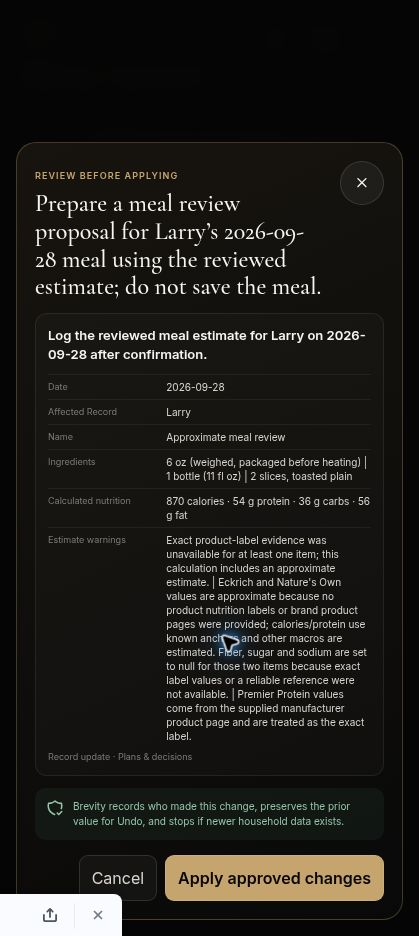

# Signed-in preview validation — September 28, 2026

Preview: PR #230. These are actual signed-in assistant requests and Netlify function observations, not the synthetic evaluation harness. No test meal or recipe changes were confirmed.

## Failures reproduced

- On `b92e4a9`, the original smoked-sausage/toast request returned numerical macros without calling the calculator. The background log recorded only `get_pillar_records` (correlation `db4a402e-13cf-4868-ae65-f5e699e74c99`). A branded follow-up repeated those unsupported numbers and did not create the requested review.
- On `822b9df`, the request used `estimate_meal_nutrition` and returned an actual proposal. However, missing packaged-product identities were still accepted by the calculator.
- The same candidate exposed a follow-up regression: `TypeError: item.content.map is not a function` in the SDK Responses converter. Assistant-history strings were not valid SDK assistant message content. Correlation `94ce25d1-94bf-4834-93ce-97cc9dad1bec`.

## Corrections

- Request instructions now belong to agent instructions. Household context and conversation remain data with their original roles.
- SDK `user()` / `assistant()` helpers convert conversation content; an integration test exercises the installed SDK request converter.
- New/corrected meal totals must come from the calculator; preparing a review is distinguished from committing a save.
- Calculator output now includes food kind, explicit quantity confirmation and packaged-product identity confirmation. Server validation rejects unresolved quantities, unresolved packaged products without approximate-estimate consent, and packaged foods without a matching supplied reference or consent. Plain whole foods require no brand.

Candidate `12a94bd`: 1,095 local tests pass; build passes. Live retest pending. Production release remains blocked on live acceptance. The 30-case synthetic model evaluation set and physical microphone testing have not run in this validation session.

## Additional live findings

- `12a94bd` correctly withheld a meal proposal pending clarification (correlation `24607d58-fb25-4d4c-bba1-f85a101cfebb`). Its clarification misattributed a product page to the user; wording and source-ownership instructions were corrected in `0ecb01b`.
- The branded follow-up no longer hit the SDK converter error, but asked the member to provide a URL/label. Missing-reference handling is now an internal `NUTRITION_REFERENCE_REQUIRED` result: the agent must research and retry, or obtain consent for an explicitly approximate estimate when its research cannot resolve the source. It must not request label transcription.

## Confirmed live improvements

- Open-ended correlation/causation question produced a substantive answer with an everyday example, without a capability menu.
- Saved recipe lookup returned the exact title and ingredient list for Smoked Turkey Breast + Garlic Kale without asking for an ID or pasted record. No recipe change was made.
- On `90f1bed`, the original ambiguous sausage/toast request asked about the sausage brand/variant and preparation weight. It did not return guessed macros or a proposal.
- Latest full regression run: 1,096 tests passed; production build passed. Branded calculation/review retest is pending.

## Review-level provenance finding

The clarified 4 oz sausage/two-slice meal reached an actual Action Mode review with 520 calories and 16 g protein. Inspection of its warnings revealed brand home pages and typical values had been treated as sufficient product evidence. This is not an exact-label accuracy pass. Added server rejection of homepage URLs and a required reference-quality classification; approximate packaged-food references require explicit estimate consent. No proposal was applied.

## Portion arithmetic finding

Changing the draft to 6 oz sausage plus one 11-fl-oz, 30-g-protein shake and two slices of toast returned 82 g protein: the single shake had effectively been doubled. Added structured consumed amount/unit and label serving amount/unit/macros. The server now converts compatible mass/volume units and multiplies per-label macros itself, overriding model whole-portion totals. Regression covers a model-returned 60 g protein for one shake being corrected to the label's 30 g, plus 6 oz sausage scaled from a 2 oz label. Incompatible serving units fail closed.

## Server-arithmetic live retest

Candidate `b8f8a54` returned 870 calories and 54 g protein for the three-food meal, counting the shake once (30 g) and sausage as three label servings (18 g). Correlation `a8b6d816-efbe-4ed8-b564-972f3cfa096c`; calculator called once; no runtime error. The model omitted the requested proposal despite saying a review was prepared. Added one bounded repair pass using the existing SDK history and calculated estimate IDs; no recalculation or save is performed by that pass.

This numerical result is not certified exact-label accuracy. Independent manufacturer-page inspection showed the Eckrich Original Skinless Rope page lists 15 g fat and 5 g carbs per 2 oz, differing from the agent's cited 17 g fat and 2 g carbs. Product reference matching and evidence quality therefore remain a release gate even when serving arithmetic is correct. Manufacturer source: https://eckrich.sfdbrands.com/en-us/products/smoked-sausage-rope/original-skinless-rope/ (checked September 28, 2026).

## Evidence retrieval correction

The nutrition server now discards agent-authored product-reference summaries and retrieves the public URLs itself using the existing DNS-pinned, private-network-blocking, size-bounded recipe fetcher. Homepages and unreadable/incomplete nutrition pages cannot count as evidence. The calculator receives fetched page text, and missing evidence returns to agent research or explicit approximation consent. Approximate items retain no exact-label source claim and carry a server-generated uncertainty warning. This prevents invented source summaries from authorizing the earlier incorrect label values.

## Final observed state — candidate 5096e74

- Explicit consent to approximation produced a real Action Mode proposal and its review dialog: 870 calories, 54 g protein, 36 g carbs and 56 g fat. The shake counted once. Approximation was prominently disclosed; this is a workflow/arithmetic check, not exact-label accuracy certification.
- The first conditional approximation consent was unnecessarily requested again; reducing repeated clarification remains a conversation-quality follow-up.
- No test meal or recipe change was applied. No PR merge or production release occurred.
- 1,100 regression tests pass; build passes. Preview deployment succeeded.
- Remaining acceptance: exact-product evidence coverage and macro accuracy across variants; physical-device voice; approved save, persisted record, correction and Undo; the full synthetic 30-case model evaluation set.

