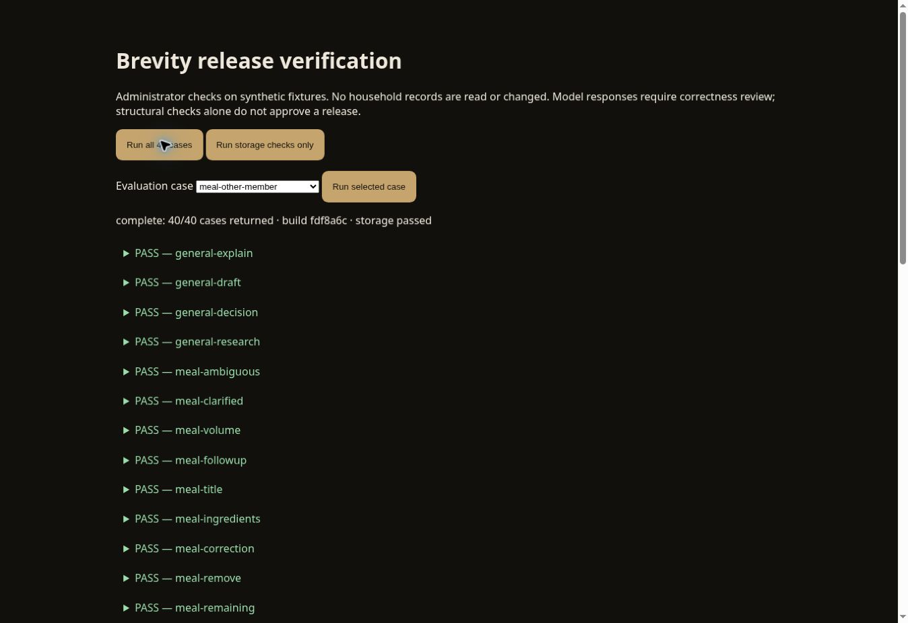

# PR #230 release candidate audit — September 29, 2026 UTC

Runtime: `fdf8a6c1fd032dc0e46f6f7461523c2e824a4092`  
Preview: https://deploy-preview-230--brevityoflife.netlify.app/  
Status: preview verification; no merge or production release.

## User-visible fixes verified

- General questions receive substantive answers; supported write actions do not constrain general reasoning, drafting or research.
- Named recipes and household records are discovered through canonical searches. The member does not have to find database IDs or paste a saved record.
- Food intake and corrections follow conversation → clarification → source research → server portion arithmetic → Action Mode review. No manual macro entry is required.
- Separate meal occasions do not inherit foods from earlier meals. The live separate-lunch request included only steak and potato. Netlify correlation `cdcec720-4295-4972-a879-22435821eb68`: proposal, 22,491 ms agent, one calculator call, no error category, no unavailable sources.
- A real saved breakfast correction found the existing record and prepared `nutrition.meal.update`, not another meal. The reviewed three-food calculation was 870 calories, 54 g protein, 44 g carbohydrates and 49 g fat. Per-food servings were visible. This review was not applied. See the earlier signed-in report for source and bread-formulation limitations.
- The saved 99.2 g protein entry contained additional foods from a separate meal. The old record was inspected, not silently altered. The latest conversational correction removes those additional foods and recalculates.
- Saved nutrition and Action Mode review honor dark mode. Review field values are 14 px with 1.55 line height; labels are 12 px; inputs are 16 px. Live visual inspection confirmed readable contrast.
- Today weather renders after removal of mutually exclusive Open-Meteo request parameters.

## Deployed model checks

The maintained set has 40 synthetic scenarios. It runs the actual deployed SDK, production instructions and contract validator. Calculator outputs are fixtures, so these results are not nutrition-label accuracy tests. Every output needs semantic review.

The prior full run (`b754709`) returned 38/40 structural passes. Its two failures were:

1. A correct household project lookup through the newly added search tool was not recognized by the evaluator. The evaluator now accepts that valid tool path.
2. A request to remember a preference produced only an acknowledgment. The explicit `remember_member_preference` tool now validates and retains the review candidate without saving anything.

Both cases passed on `fdf8a6c`; outputs were read and checked. Human review also caught a wrong meal owner in the earlier full run. Consumed search results now retain ownership, and the deployed ownership retest correctly identifies Larry's entry and produces no cross-member proposal.

Focused evidence: `release-focused-20260929.json` and `release-ownership-20260929.json`. The complete rerun on `fdf8a6c` finished with **40/40 structural passes** and all 14 persistence checks passing. Every response was inspected. Evidence: `release-final-40-20260929.json`.

Response review confirmed the corrected ownership, separate meal inputs, exact saved recipe/meal targets, open-ended answers, and supported review actions. Presentation limitations remain: one answer included a literal `Proposal: null`; a prepared meal review was worded as an offer to prepare one; and the calendar-outage answer offered a future change without explicitly repeating that source recovery is required. The server still blocks a proposal against the unavailable calendar source. Structural passes are not a claim of universally correct or polished model wording.

## Real isolated persistence

All 14 checks passed on `fdf8a6c`. The checks use the real executor, action journal and Netlify Blob, with a dedicated fixture store and every resource injected. No production household records are read or written by these checks.

Checks cover no write before execution; persisted meal save and correction; idempotent retry; stale-write and cross-member rejection; persisted Undo and audit preservation; fitness, education, spiritual and ministry plan save/Undo; improvement approval save/Undo; and member preference save/isolation/Undo. Unauthorized improvement-approval Undo and cross-member preference Undo are rejected, including for other administrators.

This verifies actual persistence, not the browser confirmation-to-storage integration. Signed-in app checks stopped at review to avoid adding test meals to the household.

## Local and CI

- 1,133 local tests passed; production build passed.
- GitHub verification run 36509959812: success.
- GitHub browser regression run 36509959825: success.
- Browser regression uses Chromium desktop and mobile/tablet emulation. It does not certify physical iOS Safari microphone capture, speech recognition or audio recovery.

## Remaining acceptance and project work

The complete project is not finished. Remaining acceptance includes physical iPhone voice, broader product/formulation coverage and measured family use. Operational backup/restore and rollback drills have not been demonstrated. The preview application still reads existing household sources; the evaluation store is isolated.

Remaining implementation includes durable server conversation sessions/retention, reviewed agent actions for actual workout and tutoring/mastery records, complete cross-pillar weekly history, photo/restaurant consumed-food intake, broader reliable nutrients, module customization and automated measured improvement delivery. Governed approval records are implemented; they do not themselves generate, deploy or roll back code. Voluntary cohort rollout depends on pilot adoption and tenant isolation.

See `../implementation-plan-progress.md` for the full implementation inventory. Passing this candidate's checks must not be described as completion of every phase or universal answer accuracy.

## Physical-device acceptance procedure

Use the preview on the actual supported iPhone/Safari device and Larry's existing session. Keep the trial at review unless intentionally recording a real meal.

| Check | Required observation |
| --- | --- |
| Start voice and describe an ambiguous meal | Spoken transcript appears once; assistant asks only missing brand/portion details |
| Answer clarification by voice | Previous confirmed details remain; Brevity researches and calculates without macro entry |
| Correct a portion by voice | Exact saved meal is found; totals are recalculated; no duplicate meal is proposed |
| Start a separate meal | Earlier meal foods are excluded unless explicitly eaten again |
| Stop/cancel recognition | No duplicate send; microphone can start again |
| Recover after an assistant failure | Busy state clears and a new voice turn can be submitted |
| Review in dark mode | Ingredients, serving arithmetic, totals, warnings and confirmation controls are legible |

Do not use an emulated browser pass as evidence that microphone capture passed these checks. Record device/OS/browser, runtime commit and observed result. Only mark an intentional real meal saved after the confirmed record and refreshed totals are visible.
